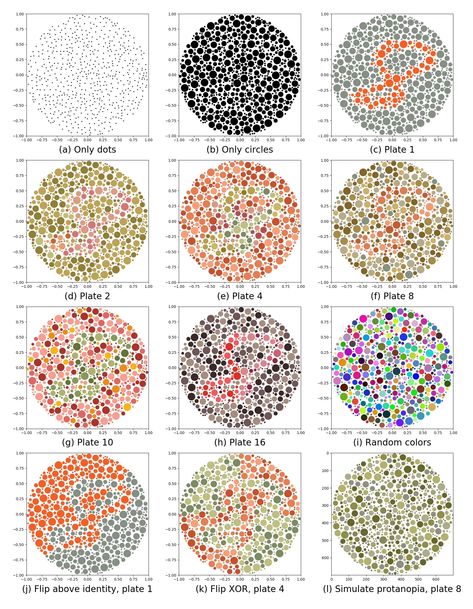

# Ishihara-like MNIST

This is the repository that provides the code to reproduce the results of the
corresponding paper. The code converts MNIST digit images into Ishihara coloblind test
images. Additionally to the base files, this code includes a Jupyter notebook that shows
how to use the code.

## Installation

Note that we used Python 3.9 for the experiments.

1. Clone this repository;
2. In the folder of the repository (e.g., `ishihara-like-mnist`), initialize the git
   submodules by
   ```bash
   git submodule init
   git submodule update
   ```
3. Install the python requirements via `pip install -r requirements.txt`

## Framework description
We offer a software package for creating different types of Ishihara plates. Additionally, we offer the data compressed in different files. The data is offered under the license Attribution-ShareAlike 3.0 Unported (<a href="https://creativecommons.org/licenses/by-sa/3.0/">CC BY-SA 3.0</a>) following MNIST's licensing scheme. See the tables below to access the data. 
For a comprehensive overview of the required licenses, please see [Licenses_Info.txt](Licensing/Licenses_Info.txt).
The repository includes three main scripts and one helping script:
1. [IshiharaConvert.py](IshiharaConvert.py): This file serves the purpose of creating the `circled MNIST` dataset. It is offered under the [LICENSE.txt](Licensing/NLE_LICENSE.txt) from NEC Laboratories Europe GmbH.

An example of what is created can be found below in [`circled MNIST`](#CircledMNIST).

2. [IshiharaCreateDS.py](IshiharaCreateDS.py): This script can be used to create colored Ishihara plates after the creation of `circled MNIST`. It contains multiple plate creators and uncolored plate manipulators. It is also offered under the [LICENSE.txt](Licensing/NLE_LICENSE.txt) from NEC Laboratories Europe GmbH.
Examples of colored plates: [`plate 1`](#Plate1), [`only circles`](#OnlyCircles), and [`random colors`](#RandomColors).

An example of a manipulated plate: [`plate 1 above_line`](#Plate1aboveline).

3. [IshiharaCreateSimDal.py](IshiharaCreateSimDal.py): This file contains six colored plate manipulators to perform simulation and daltonization applied to each of protanopia, deuteranopia, and tritanopia. It is also offered under <a href="https://www.gnu.org/licenses/old-licenses/gpl-2.0.en.html">GNU GPL version 2</a>.

An example below of a manipulated plate: [`plate 8 Sim p`](#Plate8Simp).

4. [IshiharaImagesExportImport.py](IshiharaImagesExportImport.py): This helping script serves the purpose of compressing images of a created plate to tensors in a pickle file and vice versa. It is also offered under the [LICENSE.txt](Licensing/NLE_LICENSE.txt) from NEC Laboratories Europe GmbH.

We also offer an interactive tutorial for the simulation and creation of the Ishihara MNIST images on Kaggle (<a href"https://www.apache.org/licenses/LICENSE-2.0">APACHE lincense</a>): <a href="https://www.kaggle.com/code/ammarshaker/transformmnist">https://www.kaggle.com/code/ammarshaker/transformmnist</a>.
For a static view of the tutorial, see the notebooks [TransformMNIST.ipynb](TransformMNIST.ipynb) or [TransformMNIST.html](TransformMNIST.html).

## Generating images

In this section, we explain how to generate the images which is time consuming. If you
want to skip this step, please download the images
from the table below [`circled MNIST`](#CircledMNIST). Unzip the file and place the unzipped `PFiles` folder in `output_dir`.

To get the `circled MNIST` data, [IshiharaConvert.py](IshiharaConvert.py) will produce SVG files and pickle files and then merge them to create the `circled MNIST`. At first, uncompress the MNIST provided in the `Data` folder (JPG format).
The following command shows how IshiharaConvert.py can be called:
```
python IshiharaConvert.py --data_path Data/MNIST --out_path output_dir
```

After creating the `circled MNIST`, multiple plates can be made and manipulated using [IshiharaCreateDS.py](IshiharaCreateDS.py). To generate the `only circles` plate, run the following command:

```
python IshiharaCreateDS.py --data_path output_dir/PFiles --out_path output_dir/PFiles --plate 20 --manipulation 1 
```

To generate `plate 1` from the Ishihara's test, run the following command:

```
python IshiharaCreateDS.py --data_path output_dir/PFiles --out_path output_dir/PFiles --plate 1 --manipulation 1 
```

To generate `plate 4` with with flipping `above_line` manipulation:

```
python IshiharaCreateDS.py --data_path output_dir/PFiles --out_path output_dir/PFiles --plate 4 --manipulation 4
```

For detailed description of the plates and the manipulation functions, see the arguments provided in `IshiharaCreateDS.py` in
variables `Manipulation_dic` and `Plates`.

* Manipulation options:
    * 1: `No_Manipulation`
    * 2: `upper_half`
    * 3: `right_half`
    * 4: `above_line`
    * 5: `random15`
    * 6: `chess_board`
    * 7: `chess2_board`

* Plates:
    * 1: `Plate_1`
    * 2: `Plate_2`
    * 3: `Plate_3`
    * 4: `Plate_4`
    * 5: `Plate_5`
    * 6: `Plate_6`
    * 7: `Plate_7`
    * 8: `Plate_8`
    * 9: `Plate_9`
    * 10: `Plate_10`
    * 11: `Plate_11`
    * 12: `Plate_12`
    * 13: `Plate_13`
    * 16: `Plate_16`
    * 17: `Plate_17`
    * 20: `Only_Circles`
    * 21: `Only_Dots`
    * 22: `Dots_10_disconnected`
    * 23: `Dots_10_connected`
    * 30: `Random_plates`
    * 31: `Random_colors`

To use one of the colored plate manipulators such as simulation and daltonization applied to each of protanopia, deuteranopia, and tritanopia, please use [IshiharaCreateSimDal.py](IshiharaCreateSimDal.py).

Simulating deuteranopia on `plate 1`:
```
python IshiharaCreateSimDal.py --data_path output_dir/PFiles --input_plate_path output_dir/Plate_1 --output_plate_path output_dir --simulate_color_blindness 1
```
Daltonization for protanopia on `plate 8`:
```
python IshiharaCreateSimDal.py --data_path output_dir/PFiles --input_plate_path output_dir/Plate_8 --output_plate_path output_dir --simulate_color_blindness 5
```

Finally, in order to compress (or uncompress) the images of one of the created plates, please use the script [IshiharaImagesExportImport.py](IshiharaImagesExportImport.py).
Export images to pickle files (optionally, only 10 images from each folder):
```
python IshiharaImagesExportImport.py --Plate_path output_dir/Only_Circles  --output_path output_dir --out_folder_name Only_Circles_pickle --mode 0 --MaxImages 5
```
Export tensors in pickle files into images (optionally, only 10 images from each folder):
```
python IshiharaImagesExportImport.py --Plate_path output_dir/Only_Circles_pickle  --output_path output_dir --out_folder_name Only_Circles_new --mode 1 --MaxImages 10
```


## A sample of different plate coloring



## Ishihara MNIST Data Files

<a name="#CircledMNIST">**Circled MNIST:**</a>
```
File: PFiles.tar.gz
URL1: https://1drv.ms/u/s!AiTLM7pF2hY5cP4Fcg9dmXw1fxs?e=TTzIB0
URL2: https://www.dropbox.com/s/ffzi3txg95t6zb1/PFiles.tar.gz?dl=0
Sha256sum: cd26eae1e39ab124f0a489ec3b53f2fef3d74906d31e4a1f082f70c8a4c6aadd
Size: 699MB
license:  Attribution-ShareAlike 3.0 Unported, CC BY-SA 3.0.
Description: This file contains a compressed version of the circled MNIST.

PFiles.
└─ Train_images.
|   | 0.pickle.
|   | 1.pickle.
|   | ...
└─ Test_images.
|   | 0.pickle.
|   | 1.pickle.
|   | ...

Each file Train_images\x.pickle contains the circled versions of all training images of the digit x compressed using the pickle format. The compressed files for the testing images can be found in the folder "Test_images".
Each of these files contains a dictionary that for each MNIST image xxx.jpg contains a key xxx.p for the circular version of that image.
Creation: To re-produce this data, circled MNIST, see the usage of the script IshiharaConvert.py. E.g.,:
python IshiharaConvert.py --data_path Data/MNIST --out_path Output
Usage: This data can be used further to create the colored plates; see the script IshiharaCreateDS.py. E.g., creating the plate "only circles":
python IshiharaCreateDS.py --data_path Output/PFiles --out_path Output --plate 20 --manipulation 1

```


<a name="#OnlyCircles">**Only circles:**</a>
```
File: Only_Circles.tar.gz
URL: https://drive.google.com/file/d/1HCGXeLbfc7_CFLn5AwEdk0SEAOYurnWI
Sha256sum: e889ee771db307cf195e2d7cf7c0541c8ae933f85508e544615e0b0b4e709db8
Size: 1199MB
license:  Attribution-ShareAlike 3.0 Unported, CC BY-SA 3.0.
Description:This file contains images of the only circles plate compressed in two pickle files.

Only_Circles.
└─ Train_images.
|   | Train_images.pickle.
└─ Test_images.
|   | Test_images.pickle.

The file Train_images\Train_images.pickle contains files_dic which is a dictionary of dictionaries, i.e., a dictionary for each digit. For example, for the training file "5244.jpg" (digit 0), the key, "5244.jpg", is invoked as in files_dic['0']["5244.jpg"]. The value is a pytorch tensor of shape torch.Size([3, 112, 112]). The same applies to the testing file  Test_images\Test_images.pickle
Creation: To re-produce this data, only circles, see the script IshiharaCreateDS.py.
python IshiharaCreateDS.py --data_path Output/PFiles --out_path Output --plate 20 --manipulation 1
Usage: This data can be used directly for training and testing using the enclosed tensors. It could also be used to extract the images of the plate; see the script export_import_images.py.
```

<a name="#OnlyDots">**Only dots:**</a>
```
File: Only_Dots.tar.gz
URL: https://drive.google.com/file/d/1uVqpOyOQF8H1q7_nYC5fMvgqo0CR5wYs
Sha256sum: c46ecc9f75b3c5dadaca4aa043c7a325cc09f18ba78733ece79f79af8e5ee274
Size: 468MB
license:  Attribution-ShareAlike 3.0 Unported, CC BY-SA 3.0.
Description:This file contains images of the only dots plate compressed in two pickle files.

Only_Dots.
└─ Train_images.
|   | Train_images.pickle.
└─ Test_images.
|   | Test_images.pickle.

The file Train_images\Train_images.pickle contains files_dic which is a dictionary of dictionaries, i.e., a dictionary for each digit. For example, for the training file "5244.jpg" (digit 0), the key, "5244.jpg", is invoked as in files_dic['0']["5244.jpg"]. The value is a pytorch tensor of shape torch.Size([3, 112, 112]). The same applies to the testing file  Test_images\Test_images.pickle
Creation: To re-produce this data, only dots, see the script IshiharaCreateDS.py.
python IshiharaCreateDS.py --data_path Output/PFiles --out_path Output --plate 21 --manipulation 1
Usage: This data can be used directly for training and testing using the enclosed tensors. It could also be used to extract the images of the plate; see the script export_import_images.py.
```

<a name="#Plate1">**Plate 1:**</a>
```
File: Plate_1.tar.gz
URL: https://drive.google.com/file/d/1UnNgYk8JQQadSrpiqnhqocXJXROzcirt
Sha256sum: 6f2cec0e8e64d3c1fe41ade33cfde3b1185f81abc4f1c39c297eb03c95d89f9a
Size: 2178MB
license:  Attribution-ShareAlike 3.0 Unported, CC BY-SA 3.0.
Description:This file contains images of plate 1 compressed in two pickle files.

Plate_1.
└─ Train_images.
|   | Train_images.pickle.
└─ Test_images.
|   | Test_images.pickle.

The file Train_images\Train_images.pickle contains files_dic which is a dictionary of dictionaries, i.e., a dictionary for each digit. For example, for the training file "5244.jpg" (digit 0), the key, "5244.jpg", is invoked as in files_dic['0']["5244.jpg"]. The value is a pytorch tensor of shape torch.Size([3, 112, 112]). The same applies to the testing file  Test_images\Test_images.pickle
Creation: To re-produce this data, plate 1, see the script IshiharaCreateDS.py.
python IshiharaCreateDS.py --data_path Output/PFiles --out_path Output --plate 1 --manipulation 1
Usage: This data can be used directly for training and testing using the enclosed tensors. It could also be used to extract the images of the plate; see the script export_import_images.py.
```

<a name="#RandomColors">**Random colors:**</a>
```
File: Random_colors.tar.gz
URL: https://drive.google.com/file/d/1GuNDKfsW6qNvkM06KHzRNzMMrvpxkhM6
Sha256sum: 98e707fe78a6402da7ca6f1c91412b9eac2b8fb9403e89b80b15fa34e430f6c9
Size: 3101MB
license:  Attribution-ShareAlike 3.0 Unported, CC BY-SA 3.0.
Description:This file contains images of the random colors plate compressed in two pickle files.

Random_colors.
└─ Train_images.
|   | Train_images.pickle.
└─ Test_images.
|   | Test_images.pickle.

The file Train_images\Train_images.pickle contains files_dic which is a dictionary of dictionaries, i.e., a dictionary for each digit. For example, for the training file "5244.jpg" (digit 0), the key, "5244.jpg", is invoked as in files_dic['0']["5244.jpg"]. The value is a pytorch tensor of shape torch.Size([3, 112, 112]). The same applies to the testing file  Test_images\Test_images.pickle
Creation: To re-produce this data, random colors, see the script IshiharaCreateDS.py.
python IshiharaCreateDS.py --data_path Output/PFiles --out_path Output --plate 31 --manipulation 1
Usage: This data can be used directly for training and testing using the enclosed tensors. It could also be used to extract the images of the plate; see the script export_import_images.py.
```


<a name="#Plate1aboveline">**Plate 1 above_line:**</a>
```
File: Plate_1_above_line.tar.gz
URL: https://drive.google.com/file/d/1IdNFILSDXofBHR7-v3YN_TCA_AgzCJm2
Sha256sum: b266827b246a085411304657f16e1961a133d0b3a6820e0e60f87450f60076d7
Size: 2669MB
license:  Attribution-ShareAlike 3.0 Unported, CC BY-SA 3.0.
Description:This file contains images of plate 1 changed with the uncolored manipulation function above_line compressed in two pickle files.

Plate_1_above_line.
└─ Train_images.
|   | Train_images.pickle.
└─ Test_images.
|   | Test_images.pickle.

The file Train_images\Train_images.pickle contains files_dic which is a dictionary of dictionaries, i.e., a dictionary for each digit. For example, for the training file "5244.jpg" (digit 0), the key, "5244.jpg", is invoked as in files_dic['0']["5244.jpg"]. The value is a pytorch tensor of shape torch.Size([3, 112, 112]). The same applies to the testing file  Test_images\Test_images.pickle
Creation: To re-produce this data, plate_1_above_line, see the script IshiharaCreateDS.py.
python IshiharaCreateDS.py --data_path Output/PFiles --out_path Output --plate 1 --manipulation 4
Usage: This data can be used directly for training and testing using the enclosed tensors. It could also be used to extract the images of the plate; see the script export_import_images.py.
```

<a name="#Plate4chess_board">**Plate 4 chess_board:**</a>
```
File: Plate_4_chess_board.tar.gz
URL: https://drive.google.com/file/d/1D86ghvI5XMtnXwiWugPHpq2cp2UUTW9b
Sha256sum: 168c601205b2f5df687b488a03f27894cb0bd5c0ee661c3ec155bad4068fac94
Size: 2929MB
license:  Attribution-ShareAlike 3.0 Unported, CC BY-SA 3.0.
Description:This file contains images of plate 4 changed with the uncolored manipulation function chess_board compressed in two pickle files.

Plate_4_chess_board.
└─ Train_images.
|   | Train_images.pickle.
└─ Test_images.
|   | Test_images.pickle.

The file Train_images\Train_images.pickle contains files_dic which is a dictionary of dictionaries, i.e., a dictionary for each digit. For example, for the training file "5244.jpg" (digit 0), the key, "5244.jpg", is invoked as in files_dic['0']["5244.jpg"]. The value is a pytorch tensor of shape torch.Size([3, 112, 112]). The same applies to the testing file  Test_images\Test_images.pickle
Creation: To re-produce this data, plate_4_chess_board, see the script IshiharaCreateDS.py.
python IshiharaCreateDS.py --data_path Output/PFiles --out_path Output --plate 4 --manipulation 6
Usage: This data can be used directly for training and testing using the enclosed tensors. It could also be used to extract the images of the plate; see the script export_import_images.py.
```

<a name="#Plate8Simp">**Plate 8 Sim p:**</a>
```
File: Plate_8_Sim_p.tar.gz
URL: https://drive.google.com/file/d/1A8Xgvye4hdvbBbhX81-LJpwhJEGBCN1c
Sha256sum: a361eac0829262dde6870fab96d74ffd030f7386a8b3b311d6565785edecf3c9
Size: 2700MB
license:  Attribution-ShareAlike 3.0 Unported, CC BY-SA 3.0.
Description:This file contains images ofplate 8 changed with the colored manipulation function simulate_protanopia compressed in two pickle files.

Plate_8_Sim_p.
└─ Train_images.
|   | Train_images.pickle.
└─ Test_images.
|   | Test_images.pickle.

The file Train_images\Train_images.pickle contains files_dic which is a dictionary of dictionaries, i.e., a dictionary for each digit. For example, for the training file "5244.jpg" (digit 0), the key, "5244.jpg", is invoked as in files_dic['0']["5244.jpg"]. The value is a pytorch tensor of shape torch.Size([3, 112, 112]). The same applies to the testing file  Test_images\Test_images.pickle
Creation: To re-produce this data, plate_8_Sim_p, see the script IshiharaCreateDS.py.
python IshiharaCreateSimDal.py --data_path Output/PFiles --input_plate_path Output/Plate_8 --output_plate_path Output --simulate_color_blindness 5
Usage: This data can be used directly for training and testing using the enclosed tensors. It could also be used to extract the images of the plate; see the script export_import_images.py.
```

## Contribution

You are more to welcome to contribute to the code development! In this case, make sure
you have installed pre-commit (`pip install pre-commit`) and that all checks are passed
before committing. Additionally, we use **[black](https://github.com/psf/black)** code
formatting with 88 character limit.
